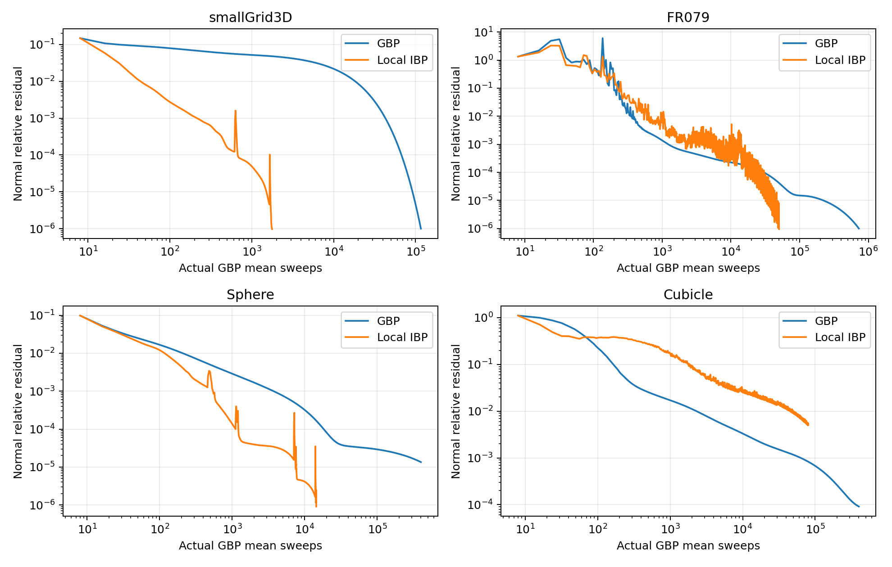
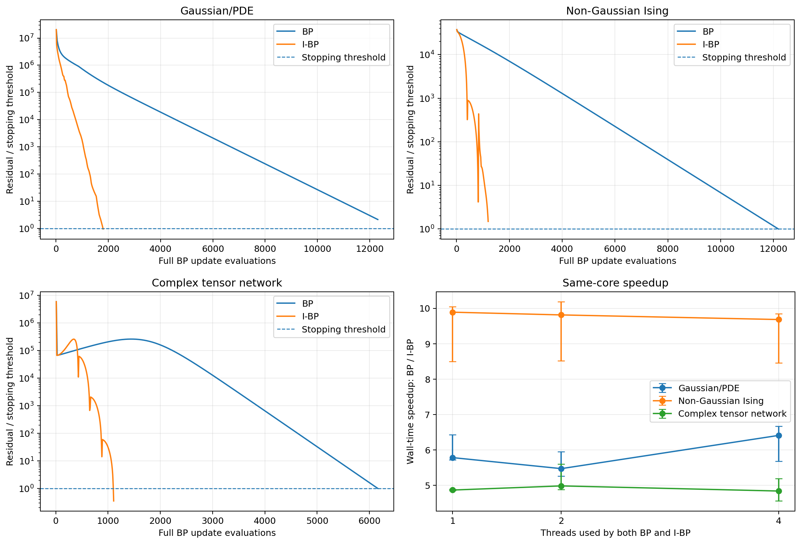

# Inertial Belief Propagation

Research implementation of **8 GBP mean sweeps + 1 local block correction**, with **independent adaptive inertia in every group**, beta capped at **0.995**, and **no filter**. This repository preserves the original `projected995` method and its measured SE(2)/SE(3) results.

The inner accelerator uses contiguous 32-node groups, local physical low-frequency modes, a balanced local residual correction, and factor-supported canonical eta injection. It does not compute a global low-frequency basis or solve a global coarse problem. Each group owns its beta and restart clock. The nonlinear wrapper uses common global cost reductions for Armijo acceptance; diagnostic norms also require reductions. This is a CPU reference implementation with logical groups, not an MPI implementation.

[Algorithm and equations](docs/algorithm.md) · [Results and limitations](docs/results.md) · [Provenance](docs/provenance.md) · [中文说明](README.zh-CN.md)

## Install and run

Python 3.11 is the verified replay environment. Run from a clone of this repository; the input files and prepared caches are included.

```bash
python -m venv .venv
# Linux/macOS: source .venv/bin/activate
# Windows PowerShell: .\.venv\Scripts\Activate.ps1
python -m pip install -r requirements-replay.txt
python -m pip install -e . --no-deps

# Fast frozen-model replay; output must be a new or empty directory.
inertial-bp frozen --dataset FR079 --method ibp --sweeps 8192 --output runs/fr079_ibp
inertial-bp frozen --dataset FR079 --method gbp --sweeps 8192 --output runs/fr079_gbp

# Fresh nonlinear solve: 20 complete cycles at each of 20 linearizations.
inertial-bp nonlinear --dataset FR079 --method ibp --outer 20 --output runs/fr079_outer_ibp
inertial-bp nonlinear --dataset Cubicle --method gbp --outer 20 --output runs/cubicle_outer_gbp

# Numerical reproduction and chart-transport checks.
python -m unittest discover -s tests -v
python scripts/verify_saved_results.py
```

Available datasets: `smallGrid3D`, `FR079`, `Sphere`, `Cubicle`. `python -m inertial_bp` is equivalent to `inertial-bp`. Use `--threads 2` **before** the subcommand to change precision preparation threads. The first run includes Numba compilation. An installed wheel does not bundle benchmark assets; pass `--data-dir` or `--cache-dir` pointing to this checkout when running outside an editable install.

## Archived results

Frozen **k0**, stopping when both normal and canonical message residuals are at most 1e-6:

| Dataset | Pure GBP mean sweeps | Local IBP mean sweeps | IBP corrections | Observed sweep ratio |
|---|---:|---:|---:|---|
| smallGrid3D | 116,200 | 1,768 | 220 | 65.72x |
| FR079 | 727,032 | 50,104 | 6,262 | 14.51x |
| Sphere | 400,000 (cap, not converged) | 14,424 | 1,802 | >27.73x to first passing checkpoint |
| Cubicle | 400,000 (cap, not converged) | 80,000 (cap, not converged) | 9,999 | No converged comparison |

These are **sweep counts, not wall-time speedups or a proof of stable acceleration**. FR079 is oscillatory despite its earlier passing checkpoint. Cubicle has worse normal residual than GBP at a common 80,000-sweep budget, although its quadratic energy gap is smaller. No universal 10x speedup or monotone full-cycle energy guarantee is claimed.

With **20 relinearizations and 20 complete cycles per relinearization**, both methods use 3,200 mean sweeps; IBP additionally uses 400 local corrections:

| Dataset | Final nonlinear cost, GBP | Final nonlinear cost, IBP | Archived elapsed seconds, GBP / IBP |
|---|---:|---:|---:|
| FR079 | 18.8432240390 | 18.8155601636 | 6.51 / 7.56 |
| Cubicle | 69,273.3951762 | 59,848.1871313 | 250.05 / 287.29 |

These timings include the recorded preparation and output overhead, on the original runtime, and are not portable performance guarantees. Precision preparation dominates these runs. The reported cost uses the repository's Lie-log/Huber model; it is not a g2o optimum or a ground-truth relative pose error.



## Three additional experiments

[ibp_more_experiments/](ibp_more_experiments/README.md) contains the C++17/OpenMP code, nine benchmark fixtures, measured results, and reproduction scripts for three further message domains:

- **Gaussian/PDE:** a 128×128 diffusion system with frozen precision. Local physical residual and temporal corrections are lifted into the information messages. Median reduction in full BP evaluations: **6.84x**; measured 4-thread speedup: **6.41x**.
- **Non-Gaussian Ising:** a 128×128 model using the exact nonlinear cavity update, with inertia applied directly to scalar messages. Median evaluation reduction: **10.03x**; measured 4-thread speedup: **9.68x**.
- **Complex tensor network:** a 32×32 network with 2×2 Hermitian positive-definite messages. Corrections in trace-free matrix-log coordinates preserve positive definiteness. Median evaluation reduction: **5.57x**; measured 4-thread speedup: **4.84x**.

These experiments use eight accepted BP sweeps per correction, local gain 0.45, and independent group beta capped at **0.95**. Ratios are medians of per-seed comparisons (seeds 201/202/203); each timing compares BP and IBP using the same thread count. Full BP evaluations include the extra residual proposal, so this figure's horizontal axis differs from the SE2/SE3 mean-sweep axis above. Timings are hardware dependent.



## Repository contents

- `src/inertial_bp/`: standalone message kernels, local basis/correction, independent beta, model assembly, and precision/eta warping. There is no runtime extraction of external research files.
- `data/`: input datasets and compact frozen k0 caches. Cached arrays are losslessly retained from the original preparation; see each cache's JSON audit.
- `results/frozen/`: full original IBP traces and comparator arrays for all four datasets.
- `results/nonlinear/`: FR079/Cubicle results, every saved pose, inner traces, and final Gaussian state for both methods.
- `results/audits/`: original numerical audits and the packaging verification record.
- `scripts/`: saved-pose verification, full frozen replay, and plot regeneration.
- `ibp_more_experiments/`: the additional Gaussian/PDE, Ising, and complex tensor-network experiments, with their own build instructions.

The fixed-root elimination, input weighting, robust loss, initialization, and warping are part of the reproducible model. In particular, Cubicle uses the explicitly recorded information eigenvalue floor of 1, and SE3 file information is paired with a Lie-log residual as in the original experiment. See [model details](docs/algorithm.md#benchmark-model-and-transport) before comparing against another solver.

This is a private research archive. No new software or dataset license is granted by this repository; upstream attribution is preserved in [data/README.md](data/README.md).
