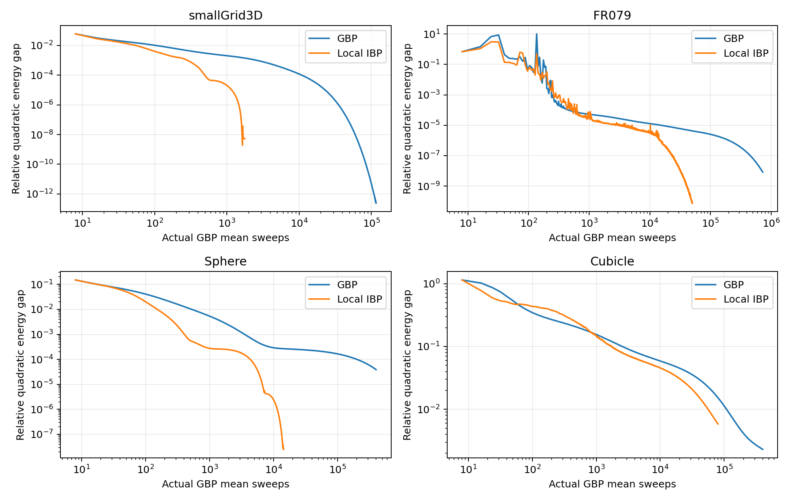

# Results and their scope

The full numeric archive is in `results/frozen/summary.json`, `results/frozen/comparison.npz`, and the four nonlinear `results.json` files. These are historical research runs preserved during packaging, not newly measured wall-time benchmarks on every platform.

## Frozen k0 comparisons

Normal residual is \(\|b-Ax\|_2/\|b\|_2\). Canonical message residual is \(\|F(\eta)-\eta\|_\infty/(1+\|\eta+offset\|_\infty)\). Both must be at most 1e-6 for the original stop. Plots sample actual trajectories at eight-sweep checkpoints, without smoothing or extrapolation.

| Dataset | IBP final normal residual | GBP final normal residual | IBP / GBP budget | Status |
|---|---:|---:|---:|---|
| smallGrid3D | 9.7407e-7 | 9.9973e-7 | 1,768 / 116,200 | Both pass |
| FR079 | 9.5104e-7 | 9.9997e-7 | 50,104 / 727,032 | Both first pass |
| Sphere | 9.0952e-7 | 1.3471e-5 | 14,424 / 400,000 | GBP capped |
| Cubicle | 5.3748e-3 | 9.1171e-5 | 80,000 / 400,000 | Both capped |

At the **same** 80,000-sweep Cubicle budget, GBP's normal residual is 8.3187e-4 versus IBP's 5.3748e-3: IBP is 6.46 times worse in this residual. Yet its relative quadratic energy gap is .005835 versus GBP's .015280. Different metrics reveal different parts of the error; lower energy alone is insufficient evidence of a stable solver.

FR079 reaches its joint threshold earlier but has repeated rises and restarts. A first passing checkpoint is not evidence of a uniform linear convergence rate or stable order-of-magnitude reduction over all intermediate budgets. The full saved curves are included so the successful endpoint is not the only evidence presented.

The comparison NPZ contains six columns: mean sweeps, F calls, normal residual, message residual, quadratic energy, and relative energy gap. Reference energy was reconstructed from the original saved reference-error diagnostic and cross-checked against the pure endpoint; it was not fed into the algorithm. The code has no global sparse reference solve in its inner update. The archive does not contain per-checkpoint measured timestamps, so no wall-time curve is inferred from sweeps.

## Relinearized comparisons

Each method takes 20 outer steps with 20 complete cycles per linearization. The inner work ledger distinguishes mean sweeps, precision preparation sweeps, corrections, and diagnostic F calls.

| Dataset / method | Mean sweeps | Precision sweeps | Local corrections | F calls | Final cost |
|---|---:|---:|---:|---:|---:|
| FR079 / GBP | 3,200 | 13,593 | 0 | 3,240 | 18.8432240390 |
| FR079 / IBP | 3,200 | 13,601 | 400 | 3,620 | 18.8155601636 |
| Cubicle / GBP | 3,200 | 14,977 | 0 | 3,240 | 69,273.3951762 |
| Cubicle / IBP | 3,200 | 14,799 | 400 | 3,620 | 59,848.1871313 |

Archived elapsed times are 6.5065 s / 7.5623 s for FR079 GBP / IBP, and 250.0459 s / 287.2915 s for Cubicle. Output and setup contribute to elapsed time. Inner kernel time alone is .1451 s / .5063 s for FR079 and 4.7733 s / 10.9790 s for Cubicle. Precision preparation dominates end-to-end runtime. These fixed-budget comparisons show cost differences; they do **not** show a 10x wall-time advantage.

All archived outer steps use alpha=1 and satisfy the common Armijo condition. Precision and canonical eta are warped between steps. This accepted nonlinear cost behavior does not imply that every inner correction or following eight-sweep cycle reduces quadratic energy.

No g2o-reference positional error or ground-truth RPE is reported. Costs depend on the declared Lie-log, robust weighting, root conditioning, and Cubicle information repair. These experiments are not a direct numerical-equivalence comparison with Hierarchy-GBP or a native g2o objective.

## Reproduction

`python scripts/replay_frozen.py --output runs/full_frozen` reruns both methods at their original caps and tolerance; FR079 pure GBP can take many sweeps. `python scripts/verify_saved_results.py` recomputes all 84 saved nonlinear costs, validates work ledgers and accepted-step inequalities, and checks the final canonical warp potential and last pose update. The test suite checks frozen prefixes on all four datasets, complete-cycle accounting, independent group beta, supported eta injection, and SE2/SE3 chart/covariance transport.

`results/audits/packaging_verification.json` records checks actually executed during repository preparation. Historical full trajectories are retained independently of fresh smoke-run results; a short smoke run is not represented as a complete rerun.
